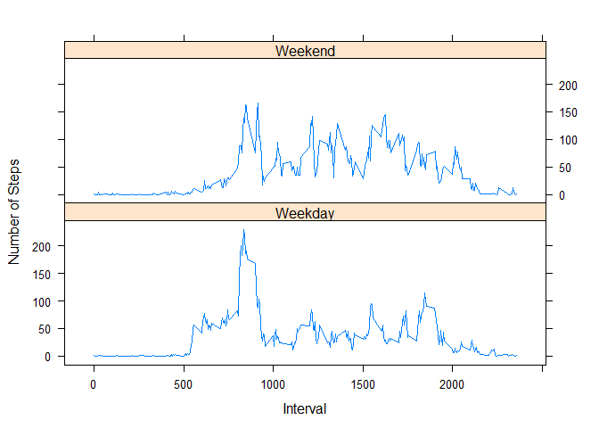

# Reproducible Research: Peer Assessment 1


## Loading and preprocessing the data
Data source: Number of steps taken in 5 minute intervals each day via a personal activity monitoring device.  The data is collected for a period of 2 months (10/1/2012 - 11/30/2012).

Location of the data set:  https://d396qusza40orc.cloudfront.net/repdata%2Fdata%2Factivity.zip


```r
#Down load zip file to current working directory,un-zip content to a directory called Activity_Data
fileURL <- "https://d396qusza40orc.cloudfront.net/repdata%2Fdata%2Factivity.zip"
download.file(fileURL,destfile="./repdata-data-activity.zip")
unzip("./repdata-data-activity.zip", exdir = "./Activity_Data", junkpaths = TRUE, files = NULL, list=FALSE)

#Read activity data into a dataframe 
activity_data <- read.csv("./Activity_Data/activity.csv")

#Get the number of rows and cols of the dataset
dim(activity_data)
```

```
## [1] 17568     3
```

```r
#Quick summary:
summary(activity_data)
```

```
##      steps                date          interval     
##  Min.   :  0.00   2012-10-01:  288   Min.   :   0.0  
##  1st Qu.:  0.00   2012-10-02:  288   1st Qu.: 588.8  
##  Median :  0.00   2012-10-03:  288   Median :1177.5  
##  Mean   : 37.38   2012-10-04:  288   Mean   :1177.5  
##  3rd Qu.: 12.00   2012-10-05:  288   3rd Qu.:1766.2  
##  Max.   :806.00   2012-10-06:  288   Max.   :2355.0  
##  NA's   :2304     (Other)   :15840
```

```r
#View first few lines of the data
head(activity_data)
```

```
##   steps       date interval
## 1    NA 2012-10-01        0
## 2    NA 2012-10-01        5
## 3    NA 2012-10-01       10
## 4    NA 2012-10-01       15
## 5    NA 2012-10-01       20
## 6    NA 2012-10-01       25
```

We can see that the data set contains 17,568 observations (rows) with 3 columns:  

* steps = number of steps taken
* date = the date the data was collected
* interval = the 5 minute interval number

For date/interval with no data, steps = NA

## What is mean total number of steps taken per day?


```r
# The code uses the sqldf package to manipulate and generate new dataframe
library(sqldf)
```

```
## Warning: package 'sqldf' was built under R version 3.2.3
```

```r
# Get the total steps, mean and median steps per day - ignoring rows where steps = 'NA'
daily_summary <- sqldf("select date, sum(steps) as total_steps_pday from activity_data where steps <> 'NA' group by date")

#view first 20 rows of the daily summary
daily_summary[1:10,]
```

```
##          date total_steps_pday
## 1  2012-10-02              126
## 2  2012-10-03            11352
## 3  2012-10-04            12116
## 4  2012-10-05            13294
## 5  2012-10-06            15420
## 6  2012-10-07            11015
## 7  2012-10-09            12811
## 8  2012-10-10             9900
## 9  2012-10-11            10304
## 10 2012-10-12            17382
```

```r
#Get information on the daily_summary data
summary(daily_summary)
```

```
##          date    total_steps_pday
##  2012-10-02: 1   Min.   :   41   
##  2012-10-03: 1   1st Qu.: 8841   
##  2012-10-04: 1   Median :10765   
##  2012-10-05: 1   Mean   :10766   
##  2012-10-06: 1   3rd Qu.:13294   
##  2012-10-07: 1   Max.   :21194   
##  (Other)   :47
```
From the summary above, we can see that:

* mean number of steps per day is 10766
* median number of steps per day is 10765


```r
#Plot a histogram of the total steps taken per day
hist(daily_summary$total_steps_pday, main="Histogram: Total steps Per Day",xlab="Total Steps")
```


## What is the average daily activity pattern?


```r
# Get the average steps per interval accoss all day for time serices plot
interval_summary <- sqldf("select interval, avg(steps) as average_steps from activity_data where steps <> 'NA' group by interval")

# Get the time interval with the highest average steps
sqldf("select * from interval_summary where average_steps = (select max(average_steps) from interval_summary)")
```

```
##   interval average_steps
## 1      835      206.1698
```
The average daily activity pattern is shown by the following time series Plot.  
The inverval with the highest number of steps is 835 (with 206 steps)

```r
# plot the time series
plot(interval_summary$interval,interval_summary$average_steps,type="l",ylab="Average Steps", xlab="Interval")
```


## Imputing missing values


```r
# Get the number of rows in the data set with steps value = 'NA'
sqldf("select count(*) as NA_count from activity_data where steps is null")
```

```
##   NA_count
## 1     2304
```

In the data set, there are 2304 rows with missing data.
For these rows, the missing data will be imputed using the interval average. After the data has been imputed, the total steps per day is calculated, as shown by a few samples below:


```r
# merge the activity data with the interval summary data
activity_data_imputed <- sqldf("select a.*, b.average_steps
                         from activity_data a, interval_summary b
                         where a.interval = b.interval")

# Update steps where value = NA with average_steps from interval
activity_data_imputed <- sqldf(c("update activity_data_imputed set steps=average_steps where steps is null","select * from activity_data_imputed")) 

# Recalculateing total steps, mean and median steps per day using the imputed data set
daily_summary_imputed <- sqldf("select date, sum(steps) as total_steps from activity_data_imputed group by date")

#viewing the first few rows
head(daily_summary_imputed)
```

```
##         date total_steps
## 1 2012-10-01       10641
## 2 2012-10-02         126
## 3 2012-10-03       11352
## 4 2012-10-04       12116
## 5 2012-10-05       13294
## 6 2012-10-06       15420
```
Below is a summary of the newly calculated data:

```r
#Get information on the daily_summary data
summary(daily_summary_imputed)
```

```
##          date     total_steps   
##  2012-10-01: 1   Min.   :   41  
##  2012-10-02: 1   1st Qu.: 9819  
##  2012-10-03: 1   Median :10641  
##  2012-10-04: 1   Mean   :10750  
##  2012-10-05: 1   3rd Qu.:12811  
##  2012-10-06: 1   Max.   :21194  
##  (Other)   :55
```

From the summary, we can see that:

* mean number of steps per day is lower (10750 vs 10766) compared to the original data set
* median number of steps per day is lower (10641 vs 10765) compared to the original data set

By looking at the histograms for the original data set vs. the imputed data set, we can also see that the frequency of day with steps between 10000 - 15000 is higher with the imputed data set.


```r
# Plot histograms side by side - old data set vs new data set
par(mfrow=c(1,2))
hist(daily_summary$total_steps,main="Original Data",xlab="Total Steps",ylim=c(0,40))
hist(daily_summary_imputed$total_steps,main="Imputed data",xlab="Total Steps",ylim=c(0,40))
```


## Are there differences in activity patterns between weekdays and weekends?

To investigate if there are any diferences in activity patterns, we first calculated the average steps for each inveral accross all weekdays (Mon-Fri) and all weekend days (Sat-Sun), then compare the time series plots side by side.


```r
# Adding a column to the data frame to denote the day of the week using the weekdays() function
activity_data_imputed$day <- weekdays(as.Date(activity_data_imputed$date))

# Changing the value of the new column to either weekday or weekend
activity_data_imputed$day[activity_data_imputed$day == "Sunday" ] <- "Weekend"
activity_data_imputed$day[activity_data_imputed$day == "Saturday" ] <- "Weekend"
activity_data_imputed$day[activity_data_imputed$day != "Weekend" ] <- "Weekday"

#get the average steps per daily interval accoss weekday vs. weekend
wday_wkend_summary <- sqldf("select interval, day, avg(steps) as average_steps from activity_data_imputed
                       group by interval, day")
```

In looking at the side by side plots, we can make the following observations:

* During the weekdays, the activity starts at an earler time (around interval 500)
* Activity level seems to be higher on the weekend


```r
#plot the time series data using the lattice plotting system
library(lattice)
xyplot(average_steps~interval | day,
       data = wday_wkend_summary,
       type='l',layout=c(1,2),
       xlab='Interval',ylab='Number of Steps')
```



